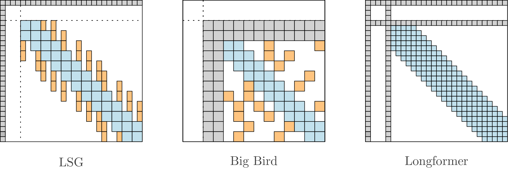
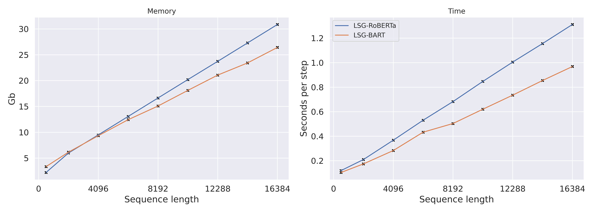

# LSG Attention: Extrapolation of pretrained Transformers to long sequences

ArXiv [paper](https://arxiv.org/abs/2210.15497) \
Accepted as a conference paper in PAKDD 2023.


Requires `transformers >= 4.36.1`

Optional package to convert models:
```bash
pip install lsg-converter
```

* [Compatible models](#compatible-models)
* [Efficiency](#efficiency)
* [Conversion](#convert-checkpoint-to-lsg)
* [Usage](#model-usage)
* [LSG-Layer](#lsg-layer)
* [LSG-Attention](#lsg-attention)
* [Experiments](#experiments)

# Compatible models
Note that for non-compatible models, the LSG attention layer is available, see [LSG-Layer](#lsg-layer) and `lsg_converter/attention_layers` for more informations. 

This package can convert various HuggingFace checkpoints and architectures to their LSG (Local-Sparse-Global) variant to handle long sequences. \
Available model types:

* ALBERT [`"albert"`]
* BART [`"bart"`] (encoder attention modified only)
* BARThez [`"barthez"`] (encoder attention modified only)
* BERT [`"bert"`]
* CamemBERT [`"camembert"`]
* DistilBERT [`"distilbert"`]
* Electra [`"electra"`]
* mBART [`"mbart"`] (not tested extensively, encoder attention modified only)
* Pegasus [`"pegasus"`] (not tested extensively, encoder attention modified only)
* RoBERTa [`"roberta"`]
* XLM-RoBERTa [`"xlm-roberta"`]

Some converted checkpoints are available [here](https://huggingface.co/ccdv).



# Efficiency
Memory and training speed for a binary classification task with 4x4096 tokens batches and Adam (RTX 8000).

| Models                     | Seconds per step | Memory w/ attn dropout  | Memory w/o attn dropout |
|----------------------------|------------------|-------------------------|-------------------------|
| Longformer-base            | 3.22 s/step      | 34.38 Gb                | 32.83 Gb                |
| BigBird-RoBERTa-base       | 2.85 s/step      | 38.13 Gb                | 38.13 Gb (no effect)    |
| LSG-RoBERTa 256/0          | 1.40 s/step      | 32.92 Gb                | 24.80 Gb                |
| LSG-RoBERTa 128/128 (norm) | 1.51 s/step      | 33.80 Gb                | 27.52 Gb                |
| LSG-RoBERTa 32/32 (norm)   | 1.20 s/step      | 24.53 Gb                | 22.53 Gb                |




# Convert checkpoint to LSG 

Models can be converted with or without the `lsg-converter` package.

## With package

BERT example with the `lsg-converter` package:

```python
from lsg_converter import LSGConverter

converter = LSGConverter(max_sequence_length=4096)

# Example 1
model, tokenizer = converter.convert_from_pretrained("bert-base-uncased", num_global_tokens=7)
print(type(model))
# <class 'lsg_converter.bert.modeling_lsg_bert.BertForMaskedLM'>

# Example 2
model, tokenizer = converter.convert_from_pretrained("bert-base-uncased", architecture="BertForSequenceClassification", use_auth_token=True)
print(type(model))
# <class 'lsg_converter.bert.modeling_lsg_bert.BertForSequenceClassification'>
```

## Without package

Use `convert_checkpoint.py` to convert a model (check model_type from config.json). \
The architecture of the model is inferred from the config file, but you can specify a different one if the config is incorrect (which can happen for BART models), see  `python convert_checkpoint.py --help`. \
To test the converted model, add `--run_test` (experimental).

RoBERTa example (from `RobertaForMaskedLM` to `RobertaForSequenceClassification`) without package:
```bash
git clone https://github.com/ccdv-ai/convert_checkpoint_to_lsg.git
cd convert_checkpoint_to_lsg

export MODEL_TO_CONVERT=roberta-base
export MODEL_NAME=lsg-roberta-base
export MAX_LENGTH=4096

python convert_checkpoint.py \
    --initial_model $MODEL_TO_CONVERT \
    --model_name $MODEL_NAME \
    --model_kwargs "{'mask_first_token': true, 'sparsity_type': 'lsh', 'block_size': 32}" \
    --architecture RobertaForSequenceClassification \
    --max_sequence_length $MAX_LENGTH
```

# Model Usage

Works with the AutoClass.

```python
from transformers import AutoTokenizer, AutoModelForMaskedLM

# Load created model
MODEL_NAME = "lsg-roberta-base"
SENTENCE = "This is a test sentence."

model = AutoModelForMaskedLM.from_pretrained(MODEL_NAME, trust_remote_code=True)
tokenizer = AutoTokenizer.from_pretrained(MODEL_NAME)

inputs = tokenizer(SENTENCE, return_tensors="pt")
model(**inputs)
```

```python
from transformers import AutoTokenizer, AutoModelForSequenceClassification

# Load created model
MODEL_NAME = "lsg-roberta-base"
SENTENCE = "This is a test sentence."

model = AutoModelForSequenceClassification.from_pretrained(MODEL_NAME, trust_remote_code=True)
tokenizer = AutoTokenizer.from_pretrained(MODEL_NAME)

inputs = tokenizer(SENTENCE, return_tensors="pt")
model(**inputs)
```

# LSG-Layer

You can find a self contained implementation of LSG attention (with no additional params), see `lsg_converter/attention_layers`. \
Doesn't work for Cross Attention because the local context is ambiguous to define in this case. 

Usage:

```python
import torch
from lsg_converter.attention_layers import BlockLocalSelfAttention, LSGSelfAttention

# batch, num_heads, sequence length, hidden_size
n, h, t, d = 2, 4, 58, 32  

Q, K, V = torch.randn(n, h, t, d), torch.randn(n, h, t, d), torch.randn(n, h, t, d)
attention_mask = torch.zeros(n, 1, 1, t).float()

# Only block local attention with 1 global connection
attn = BlockLocalSelfAttention(block_size=16, compute_global_attention=True, is_causal=False, attention_dropout_prob=0.1)

# LSG attention with 1 global connection
attn = LSGSelfAttention(block_size=32, sparsity_factor=8, sparsity_type="bos_pooling", compute_global_attention=True, is_causal=True)

# expect (batch, num_heads, sequence_length, hidden_size) inputs,
# attention_mask is (batch, 1, 1, sequence_length) 
# causal mask is built on the fly but (batch, 1, sequence_length, sequence_length) mask is possible
outputs = attn(Q, K, V, attention_mask)

print(outputs.shape)
> torch.Size([2, 4, 58, 32])
```

Example: replacing Self Attention in GPT2 (from Huggingface):
```python
from transformers.models.gpt2 import * 
from lsg_converter.attention_layers import BlockLocalSelfAttention

class GPT2BlockLocalAttention(modeling_gpt2.GPT2Attention):
    def __init__(self, config, is_cross_attention=False, layer_idx=None):
        super().__init__(config, is_cross_attention, layer_idx)
        self.attn = BlockLocalSelfAttention(block_size=32, compute_global_attention=True, is_causal=True)

    def _attn(self, query, key, value, attention_mask=None, head_mask=None):
        return self.attn(query, key, value, attention_mask), None
    
modeling_gpt2.GPT2Attention = GPT2BlockLocalAttention
```
Note that for generation (inference on causal modeling), full attention is used after the first step. \
This may change in the future.

# LSG Attention

LSG relies on 3 components: block local attention, sparse attention and prepended global attention.

## Parameters
You can change various parameters like : 
* local block size (block_size=128)
* sparse block size (sparse_block_size=128)
* sparsity factor (sparsity_factor=2)
* mask_first_token (mask first token since it is redundant with the first global token)
* the number of global tokens (num_global_tokens=1)
* see config.json file

## Sparse selection type
There are 6 different sparse selection patterns. The best type is task dependent. \
If `sparse_block_size=0` or `sparsity_type="none"`, only local attention is considered. \
Note that for sequences with length < 2*block_size, the type has no effect.
* `sparsity_type="bos_pooling"` (new)
    * weighted average pooling using the BOS token 
    * Works best in general, especially with a rather large sparsity_factor (8, 16, 32)
    * Additional parameters:
        * None
* `sparsity_type="norm"`, select highest norm tokens
    * Works best for a small sparsity_factor (2 to 4)
    * Additional parameters:
        * None
* `sparsity_type="pooling"`, use average pooling to merge tokens
    * Works best for a small sparsity_factor (2 to 4)
    * Additional parameters:
        * None
* `sparsity_type="lsh"`, use the LSH algorithm to cluster similar tokens
    * Works best for a large sparsity_factor (4+)
    * LSH relies on random projections, thus inference may differ slightly with different seeds
    * Additional parameters:
        * lsg_num_pre_rounds=1, pre merge tokens n times before computing centroids
* `sparsity_type="stride"`, use a striding mecanism per head
    * Each head will use different tokens strided by sparsify_factor
    * Not recommended if sparsify_factor > num_heads
* `sparsity_type="block_stride"`, use a striding mecanism per head
    * Each head will use block of tokens strided by sparsify_factor
    * Not recommended if sparsify_factor > num_heads

# Experiments

See `experiments/`